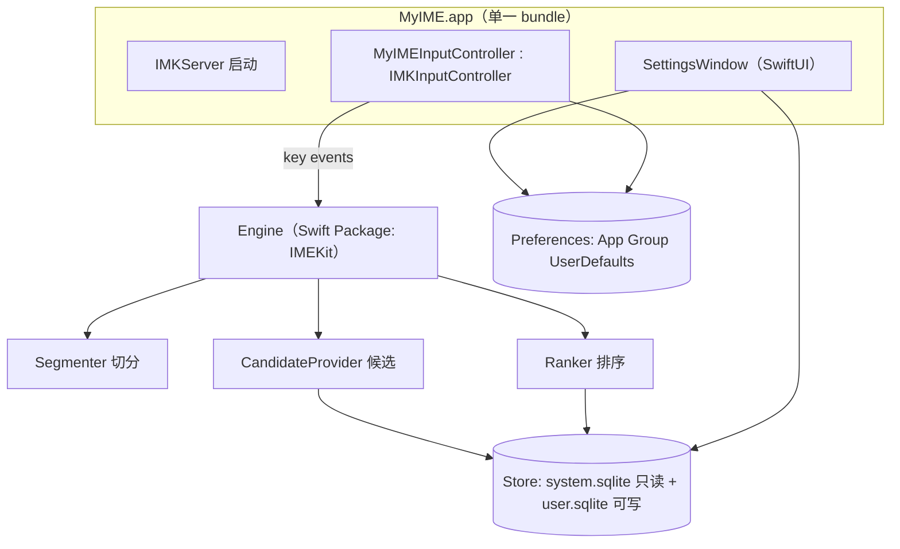
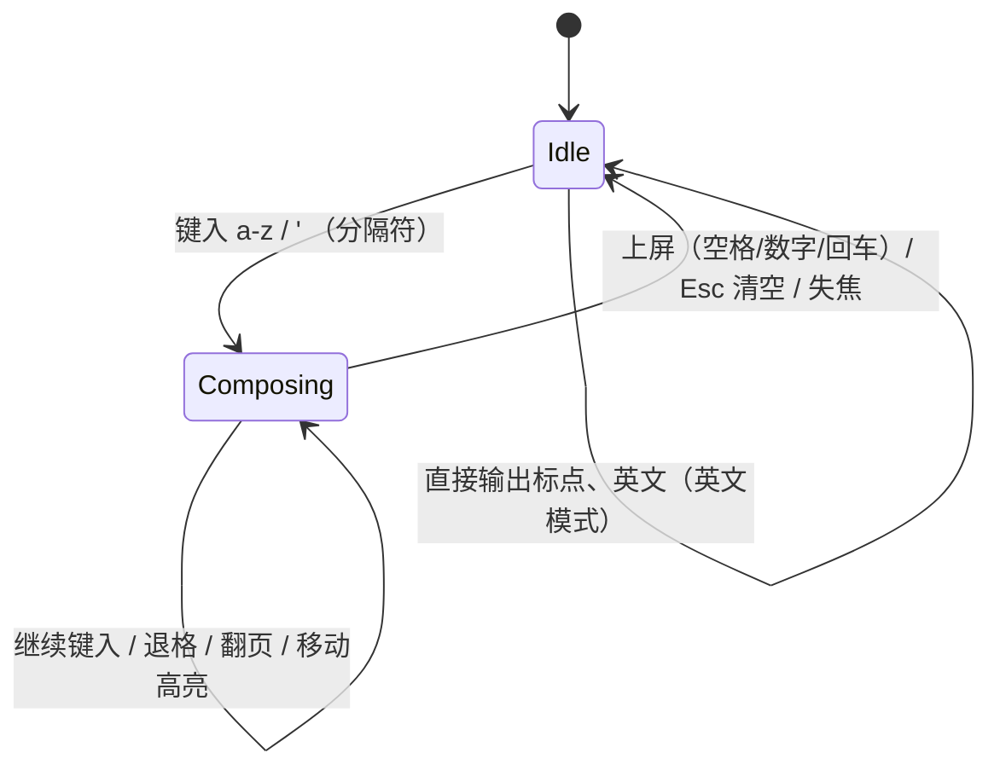

# MyIME 规格说明书（SPEC v1.0）

> 目标读者：负责实现的另一个 AI / 工程师。
> 本文件是**唯一权威规格**。实现方 MUST 严格按本文执行；任何偏离 MUST 先在 PR 说明中记录理由。
> 配套文档：
> - `docs/DICTIONARY_PIPELINE.md` —— 词库综合（7 个来源）编译流水线。
> - `docs/FOOLPROOFING.md` —— 防呆机制清单与验收门（Gate）。**动工前必读，交付前逐条自检。**

关键词遵循 RFC 2119：MUST / MUST NOT / SHOULD / MAY。

---

## 0. 一句话定义

MyIME 是一个 **macOS 全拼中文输入法**，基于 **InputMethodKit (IMK)**，**完全离线**，候选词由本地编译词库驱动，带用户自学习。仓库当前是 SwiftUI + SwiftData 模板，需按本规格改造为 IMK 输入法 + 配套设置窗口。

---

## 1. 现状与目标

### 1.1 仓库现状（已核实）
- 平台：macOS，`SDKROOT = macosx`，`MACOSX_DEPLOYMENT_TARGET = 26.5`，`SWIFT_VERSION = 5.0`。
- Bundle id：`fudan.miniS.MyIME`；`DEVELOPMENT_TEAM = 5N66S29EK2`。
- 目标：`MyIME`（App）、`MyIMETests`、`MyIMEUITests`。
- 现有代码为默认模板：`MyIMEApp.swift`（SwiftData `ModelContainer`）、`ContentView.swift`（Item 列表）、`Item.swift`（`@Model`）。
- 当前开启：`ENABLE_APP_SANDBOX = YES`、`ENABLE_HARDENED_RUNTIME = YES`。**⚠ 见 §3.4 沙盒决策，这是首要防呆点。**

### 1.2 v1.0 范围（MUST）
1. 可被 macOS 系统识别、在「系统设置 → 键盘 → 输入法」中添加的输入法。
2. 全拼输入：全拼、简拼（首字母）、混拼；模糊音可配置。
3. 候选词窗口：翻页、数字选词、空格上屏、标点处理、中英文切换。
4. 词库：综合 §DICTIONARY_PIPELINE 中已通过许可证审核的来源，编译为本地只读库。
5. 用户自学习：词频自适应 + 用户自造词，写入用户可写库。
6. 设置界面：模糊音开关、候选数、皮肤、词库管理（启用/禁用来源、重建、导入/导出用户词）。

### 1.3 明确的非目标（MUST NOT 在 v1.0 实现）
- 双拼（数据已具备，v1.1 再做；本版仅预留配置位）。
- 云输入 / 联网词库更新 / 任何网络请求。
- 手写、语音、五笔、注音。
- iOS 键盘扩展（本仓库是 macOS）。

> 假设记录：题面未指定平台，据工程配置判定为 **macOS**。若需 iOS，属另一 SPEC，MUST 停止并确认。

---

## 2. 术语

| 术语 | 含义 |
|---|---|
| Engine | 拼音切分 + 候选生成 + 排序的纯逻辑内核，无 UI、无 IMK 依赖。 |
| Controller | `IMKInputController` 子类，桥接系统输入事件与 Engine。 |
| Composition buffer | 用户已键入、尚未上屏的拼音串（预编辑文本）。 |
| Candidate | 一个候选词条：`{word, pinyinPath, score}`。 |
| Syllable | 合法拼音音节（约 410 个，见 §5.1）。 |
| CIF | Canonical Intermediate Format，词库归一中间格式（见 DICTIONARY_PIPELINE）。 |
| Store | 运行时词库（只读系统库 + 可写用户库）。 |

---

## 3. 架构



### 3.1 目标与产物结构（MUST）
- **保留单一 `MyIME.app` bundle**，它同时是输入法服务器与设置界面宿主。
- 新增本地 Swift Package **`IMEKit`**（纯逻辑：Engine、Store、词库读写、无 AppKit 依赖），供 App 与单元测试共用。
  - 理由（防呆）：IMK 进程由系统托管、难以直接跑 XCTest；把可测逻辑抽到独立 package，测试覆盖率才有保障。
- App target 依赖 `IMEKit`。

### 3.2 目标文件布局（建议）
```
MyIME/
  IMEKit/                         # Swift Package（新增）
    Sources/IMEKit/
      Engine/                     # Segmenter, PinyinTable, FuzzyRules, Ranker, CandidateProvider
      Store/                      # StoreReader, UserStore, Schema
      Model/                      # Candidate, Composition, EnginePrefs
    Tests/IMEKitTests/            # 单元测试 + golden 用例
  MyIME/MyIME/
    App/
      MyIMEApp.swift              # @main：初始化 IMKServer + Settings Scene
      IMKBootstrap.swift          # IMKServer(name:bundleIdentifier:)
    Controller/
      MyIMEInputController.swift  # IMKInputController 子类
    UI/
      CandidateWindow/            # 自绘候选窗（NSPanel）
      Settings/                   # SwiftUI 设置界面
    Resources/
      system.sqlite               # 由 DICTIONARY_PIPELINE 编译产物拷入
      Info.plist                  # IMK 注册键（见 §3.3）
  tools/                          # 词库编译脚本（见 DICTIONARY_PIPELINE）
  docs/
```
> 防呆：`Item.swift` / SwiftData `ModelContainer` 属模板残留，v1.0 用户库改用 SQLite（§6）。实现方 MUST 删除 `Item.swift` 与 `MyIMEApp` 里的 `sharedModelContainer`，并迁移全部引用（`ContentView` 里的 `@Query`/`modelContext`）。不留 SwiftData 死代码。

### 3.3 IMK 注册（Info.plist，MUST 精确）
输入法靠 `Info.plist` 键被系统发现。MUST 包含：
- `InputMethodConnectionName`（String）：如 `MyIME_1_Connection`。MUST 与 §3.5 `IMKServer(name:)` 完全一致。
- `InputMethodServerControllerClass`（String）：主控制器类的 **Objective-C 运行时名**，如 `MyIME.MyIMEInputController`（Swift 类需 `@objc(...)` 或含模块前缀）。
- `tsInputMethodCharacterRepertoireKey`（Array<String>）：`["zh-Hans"]`。
- `ComponentInputModeDict` → `tsInputModeListKey` → 输入模式字典：
  - key 如 `fudan.miniS.MyIME.inputmode.Chinese`
  - `TISInputSourceID` = 同上
  - `TISIntendedLanguage` = `zh-Hans`
  - `tsInputModeAlternateMenuIconFileKey` / `tsInputModeIconID`（图标资源名）
- `LSBackgroundOnly = 0` 且以 `NSApplication` 常驻 agent 方式运行；输入法进程 MUST NOT 抢占 Dock 焦点（设置窗口按需显示）。
- `CFBundlePackageType = APPL`。

> 防呆：类名不一致 / 连接名不一致 / repertoire 语言写错，是 IME「装了但选不出、选了不出字」的头号原因。见 FOOLPROOFING Gate G-IMK。

### 3.4 沙盒与签名决策（MUST，首要防呆）
- 系统级输入法需要注入到任意宿主 App 的输入会话。**v1.0 采用非 App Store 分发**：
  - **`ENABLE_APP_SANDBOX = NO`**（关闭模板默认的沙盒）。
  - `ENABLE_HARDENED_RUNTIME = YES` 保留；发布走 Developer ID 签名 + 公证（notarization）。
- 安装位置：`~/Library/Input Methods/MyIME.app`（用户级）。安装后 MUST 触发 `TISRegisterInputSource` 或提示用户注销/重登以刷新输入源列表。
- 若未来要上架 App Store（沙盒强制开启），属独立里程碑，需 App Group + 受限能力，**不在 v1.0**。
> 决策理由：沙盒下输入法能力受限、调试成本高。选「非沙盒 + Developer ID + 公证」是社区主流（参考 Squirrel/Fcitx-macos 形态）——最稳妥、最少坑。任何改动沙盒设置 MUST 在 PR 说明。

### 3.5 IMKServer 启动
```swift
// IMKBootstrap.swift（示意，非最终代码）
let server = IMKServer(name: "MyIME_1_Connection",
                       bundleIdentifier: Bundle.main.bundleIdentifier)
```
- MUST 在 `@main` 应用启动最早期创建并强引用 `IMKServer`，生命周期与进程一致。
- 加载候选皮肤前 MUST 完成 Engine.warmup（预载音节表 + 打开只读 Store）。

---

## 4. 输入控制器行为规格（Controller ↔ Engine）

Controller 是**薄适配层**：把系统事件翻译成 Engine 调用，把 Engine 输出渲染为预编辑文本/候选窗/上屏。**所有语言逻辑在 Engine，Controller MUST NOT 含拼音规则。**

### 4.1 状态机


### 4.2 按键映射（默认，全部可在设置改；MUST 实现默认）
| 输入 | Idle | Composing |
|---|---|---|
| `a`–`z` | 进入 Composing，追加 | 追加到 buffer，重算候选 |
| `'` | 输出 `'`（或按标点规则） | 音节分隔符，插入软边界 |
| `Space` | 输出空格 | 上屏当前高亮候选 |
| `1`–`9` | 输出数字 | 选择第 N 个候选上屏 |
| `0` | 输出 | 无操作（或保留） |
| `Return` | 换行 | **上屏 buffer 原始字母串**（不转中文），清空 |
| `Backspace` | 交给宿主 | 删除 buffer 末字符；空则回 Idle |
| `Esc` | 交给宿主 | 清空 buffer，回 Idle，**不上屏** |
| `-` / `=` 或 `,`/`.` | 标点 | 上一页 / 下一页（可配置） |
| `Shift`（单击） | 切换中/英模式 | 上屏 buffer 字母（可配置） |
| 方向键 ←/→ | 交给宿主 | 移动候选高亮 / 移动编辑光标（可配置，v1.0 先做移动高亮） |
| 其它可打印标点 | 按标点表输出（全/半角） | 先上屏当前高亮，再输出该标点 |

### 4.3 预编辑（marked text）
- Composing 期间 MUST 通过 `client.setMarkedText(_, selectionRange:replacementRange:)` 显示带下划线的拼音串；SHOULD 用音节边界（如 `nihao` 显示为 `ni'hao` 或分段高亮）。
- 上屏 MUST 用 `client.insertText(_, replacementRange:)`，之后立即 `setMarkedText("")` 清空预编辑。

### 4.4 Engine 接口契约（MUST 稳定）
```swift
public protocol IMEEngine {
    /// 追加/编辑后重算。输入为规范化后的拼音串（仅 a-z 与 '）。
    func update(_ raw: String, prefs: EnginePrefs) -> EngineOutput
    /// 选择第 index 个候选后，返回剩余 buffer 的新状态（支持逐词上屏）。
    func select(_ index: Int, from output: EngineOutput) -> SelectResult
    /// 提交学习（上屏成功后调用；失败不得抛出）。
    func commitLearning(word: String, pinyin: [String])
}

public struct EngineOutput {
    public let preedit: String          // 供 marked text 显示（带 ' 分隔）
    public let candidates: [Candidate]  // 已排序，页无关（分页在 Controller）
    public let hasMore: Bool
}
public struct SelectResult {
    public let commitText: String       // 需上屏的文本
    public let remainingRaw: String     // 未消费的拼音（逐词上屏时非空）
}
```
- Engine 全部方法 MUST 为纯函数式/无 UI 副作用（学习写库除外）。
- Engine MUST NOT 抛异常到 Controller；内部错误降级为「空候选 + 原样字母可上屏」。见 FOOLPROOFING。

---

## 5. 拼音引擎规格

### 5.1 音节表
- 内置合法全拼音节集合（约 410 个，含 `ê`/`ng` 等边角按标准处理），以资源 `syllables.txt` 或编译进 `IMEKit`。
- 声母表、韵母表、整体认读音节单列，供切分与模糊音展开。

### 5.2 切分（Segmenter）
- 目标：把连续字母串 `raw` 切成一个或多个「音节序列」候选路径。
- 算法（MUST）：在 `raw` 上构建 DAG：位置 `i→j` 有边当且仅当 `raw[i..<j]` ∈（音节表 ∪ 模糊展开 ∪ 单声母简拼）。
- 支持三类：
  1. **全拼**：每段是完整音节。
  2. **简拼**：单个声母字母作为一个音节占位（如 `bj` → `b'j`）。
  3. **混拼**：全拼与简拼混合（如 `beij` → `bei'j`）。
- 输出：按「音节数少、全拼优先、无孤立字母优先」排序的前 K 条路径（K 默认 8）。
- MUST 处理：`'` 为硬边界；非法残段（无法成音节的尾巴）保留为「待续」段，仍产出已成段的候选。

### 5.3 模糊音（FuzzyRules，可配置，默认全关）
成对、双向、可独立开关（至少实现）：
`z=zh`、`c=ch`、`s=sh`、`n=l`、`f=h`、`r=l`、`an=ang`、`en=eng`、`in=ing`、`ian=iang`、`uan=uang`。
- 模糊展开在切分建边阶段介入：一条边可由「原串或其模糊等价」命中音节表。
- 模糊命中的路径 MUST 在排序上轻微降权（见 §5.5），避免淹没精确匹配。

### 5.4 候选生成（CandidateProvider）
- 对每条切分路径的音节序列，向 Store 查询：
  - **整词**：完整音节序列命中的词（`pinyinKey` 精确 + 前缀）。
  - **逐字**：单音节的单字候选（用于组字兜底）。
  - **简拼**：由 `initials` 索引命中（首字母序列）。
- 结果按 `(word, pinyinPath)` 去重合并。
- MUST 保证「至少有单字兜底」：任何合法首音节都要能出至少一个字，杜绝空候选（除非 buffer 无任何合法音节）。

### 5.5 排序（Ranker，MUST 确定性）
候选分数（越大越靠前）：
```
score = w_freq   * norm(dictWeight)          // 词库归一频率 0..1
      + w_user   * userBoost(word)           // 用户历史（近期加权）
      + w_len    * lengthBonus(word)         // 整词优先于碎词
      + w_ctx    * bigram(prevCommitted, word)// 上一次上屏词的二元接续
      - p_fuzzy  * fuzzyPenalty               // 命中模糊音的惩罚
      - p_partial* partialPenalty             // 含简拼/未成段的惩罚
```
- 默认权重写入 `EnginePrefs`，MUST 有单测锁定「同输入 → 同顺序」（确定性；相同分数用 `word` 字典序 + `id` 兜底 tie-break）。
- 首选项（index 0）MUST 是最常见期望词：`nihao→你好`、`shjie/shijie→世界`、`beijing→北京` 等（写成 golden 测试，见 FOOLPROOFING G-ENG）。

### 5.6 性能预算（MUST 达标，见 FOOLPROOFING 基准）
- 单次 `update`（≤6 音节，候选取前 100）：**P95 < 20ms**（Release，M 系列）。
- 冷启动 warmup < 300ms。
- 常驻内存（只读库 mmap）：< 80MB。

---

## 6. 存储（Store）

### 6.1 只读系统库 `system.sqlite`
由 DICTIONARY_PIPELINE 编译生成，随 App 打包。Schema（MUST）：
```sql
CREATE TABLE meta(key TEXT PRIMARY KEY, value TEXT);          -- schema_version, build_hash, source_manifest, entry_count
CREATE TABLE entries(
  id       INTEGER PRIMARY KEY,
  word     TEXT NOT NULL,           -- 简体，NFC
  pinyin   TEXT NOT NULL,           -- 音节以 ' 连接：ni'hao
  py_key   TEXT NOT NULL,           -- 无分隔拼接：nihao（查询主键）
  initials TEXT NOT NULL,           -- 首字母：nh
  weight   INTEGER NOT NULL         -- 归一频率 0..65535
);
CREATE INDEX idx_pykey    ON entries(py_key);
CREATE INDEX idx_pyprefix ON entries(py_key, weight DESC);
CREATE INDEX idx_initials ON entries(initials, weight DESC);
```
- 前缀查询用 `py_key GLOB 'ni*'`（或 `>=`/`<` 区间，见性能）。
- 只读打开：`PRAGMA query_only=ON;`，`SQLITE_OPEN_READONLY`。
- 访问库文件 MUST 通过 `libsqlite3`（系统自带）或轻量封装；MAY 用 GRDB，但 v1.0 SHOULD 直接封装以减依赖。

### 6.2 可写用户库 `user.sqlite`
位于 `~/Library/Application Support/fudan.miniS.MyIME/user.sqlite`：
```sql
CREATE TABLE user_freq(word TEXT, pinyin TEXT, count INTEGER, last_used INTEGER, PRIMARY KEY(word,pinyin));
CREATE TABLE user_phrase(word TEXT, pinyin TEXT, weight INTEGER, created INTEGER, PRIMARY KEY(word,pinyin));
CREATE TABLE bigram(prev TEXT, word TEXT, count INTEGER, PRIMARY KEY(prev,word));
```
- 首次运行 MUST 若不存在则创建，并做 schema 版本校验。
- 写入 MUST 异步、批量、事务化；写失败 MUST 静默降级（学习是增强，不能影响打字）。

### 6.3 用户词导入/导出
- 导出：`user.sqlite` → 明文 TSV（`word<TAB>pinyin<TAB>weight`）。
- 导入：TSV → 合并到 `user_phrase`，MUST 走与 CIF 相同的校验（合法拼音、简体、NFC）。

---

## 7. 设置界面（SwiftUI）

复用现有 SwiftUI target 承载设置窗口（`Settings` scene 或独立 `Window`）。MUST 提供：
1. **通用**：候选个数（3–9）、上屏键、翻页键、中英切换键、简/繁输出（默认简）。
2. **模糊音**：§5.3 全部开关。
3. **皮肤**：字号、深浅色跟随系统、横/竖候选。
4. **词库管理**：
   - 显示 `system.sqlite` 的 `meta`（版本、词条数、来源清单、build_hash）。
   - 各来源启用/禁用（写入 `EnginePrefs`，运行时用 `source` 位过滤——故 `entries` MAY 增列 `source_mask`，见 DICTIONARY_PIPELINE §合并）。
   - 「重建/替换词库」入口（拷贝新 `system.sqlite`，校验后原子替换）。
   - 用户词导入/导出、清空用户学习。
- 设置读写 MUST 通过共享 `EnginePrefs`（`UserDefaults(suiteName:)`，App Group `group.fudan.miniS.MyIME`），Controller 与设置窗共享同一份。
> 防呆：Controller 与 UI 分处（可能）不同进程读同一偏好，MUST 监听变更（`KVO`/`NotificationCenter`/轮询），改设置后无需重启即时生效；至少保证「切输入源后生效」。

---

## 8. 里程碑（建议顺序，每步须过对应 Gate）

1. **M1 词库流水线**：产出 `system.sqlite`（DICTIONARY_PIPELINE 全流程）。Gate：G-DICT。
2. **M2 Engine**：切分 + 候选 + 排序 + 单测/golden，纯 `IMEKit`，命令行可跑。Gate：G-ENG。
3. **M3 IMK 打通**：能装、能选、能出字（先用 `IMKCandidates` 简易窗）。Gate：G-IMK。
4. **M4 自绘候选窗 + 交互全集**：翻页/数字/标点/中英切换。Gate：G-UX。
5. **M5 用户学习 + 设置界面**。Gate：G-LEARN。
6. **M6 发布**：签名 + 公证 + 安装器/说明。Gate：G-SHIP。

---

## 9. 验收与防呆

所有 Gate、运行时防呆规则、数据完整性校验、性能基准、许可证合规，见 **`docs/FOOLPROOFING.md`**。交付前 MUST 逐条自检并在 PR 勾选。

---

## 10. 假设与待确认（实现方遇到 MUST 停下确认）
- A1：平台 = macOS（据工程配置）。若目标含 iOS，停下确认。
- A2：分发 = Developer ID + 公证，非沙盒（§3.4）。若必须 App Store 上架，停下确认。
- A3：输出默认简体；繁体仅作为 UI 开关的输出转换（OpenCC s2t），不改词库。
- A4：v1.0 只做全拼；双拼、云输入明确顺延。
